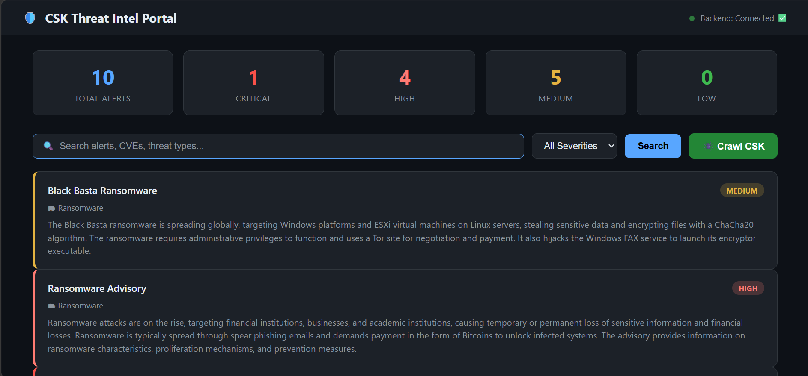
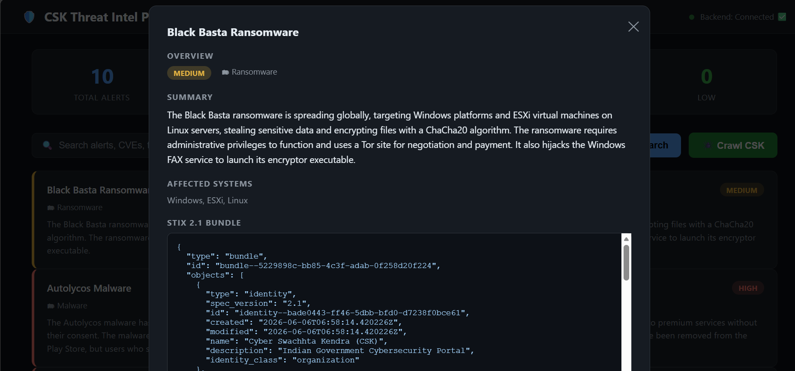
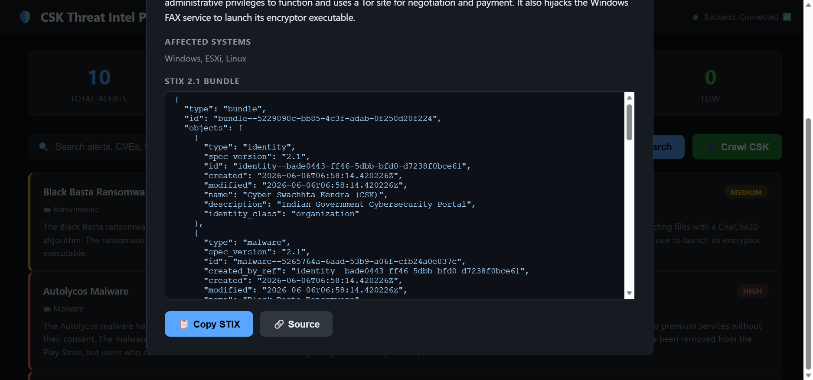

# 🛡️ CSK Threat Intelligence Portal

> An AI-powered full-stack application that automatically crawls cybersecurity alerts from the **Cyber Swachhta Kendra (CSK)** portal, enriches them using **Groq AI (LLaMA 3.3 70B)**, converts them into structured **STIX 2.1** threat intelligence bundles, and presents them through a searchable web interface.
> 
> Built as part of the **Seconize Internship Screening Assignment**.

---

## 📸 Screenshots


| Dashboard | Alert Detail | STIX Viewer |
|-----------|-------------|-------------|
|  |  |  |

---

## 🎥 Demo Video


[](https://drive.google.com/file/d/1tllQD4Rox8-wbt9fdzEhYDXPjudA34L_/view?usp=sharing)

---

## 📐 Architecture

```
┌─────────────────────────────────────────────────────────────────┐
│                        USER BROWSER                             │
│                  frontend/index.html                            │
│           (Search · Filter · Browse · STIX Viewer)              │
└──────────────────────────┬──────────────────────────────────────┘
                           │ REST API calls
                           ▼
┌─────────────────────────────────────────────────────────────────┐
│                     FASTAPI BACKEND                             │
│                    backend/main.py                              │
│                                                                 │
│   GET /api/alerts     POST /api/crawl     GET /api/stats        │
│   GET /api/alerts/:id GET /api/alerts/:id/stix                  │
└────────┬──────────────────┬───────────────────────┬────────────┘
         │                  │                       │
         ▼                  ▼                       ▼
┌─────────────┐   ┌──────────────────┐   ┌──────────────────────┐
│   SCRAPER   │   │   AI ENRICHER    │   │   STIX CONVERTER     │
│ scraper.py  │   │  enricher.py     │   │ stix_converter.py    │
│             │   │                  │   │                      │
│ Playwright  │──▶│  Groq API        │──▶│  stix2 library       │
│ Chromium    │   │  LLaMA 3.3 70B   │   │  STIX 2.1 Bundles    │
└─────────────┘   └──────────────────┘   └──────────────────────┘
         │                                          │
         └──────────────────┬───────────────────────┘
                            ▼
              ┌─────────────────────────┐
              │       DATABASE          │
              │     database.py         │
              │   SQLite + SQLAlchemy   │
              │      alerts.db          │
              └─────────────────────────┘
                            │
                            ▼
              ┌─────────────────────────┐
              │   csk.gov.in WEBSITE    │
              │  (Public Govt Portal)   │
              └─────────────────────────┘
```

### Pipeline Flow

```
Click "Crawl CSK"
      │
      ▼
Fetch alert list from csk.gov.in/alerts.html
      │
      ▼
For each NEW alert (max 10 per run):
      │
      ├──▶ Playwright opens alert page in headless Chromium
      │
      ├──▶ Extract full text content from rendered page
      │
      ├──▶ Send text to Groq API (LLaMA 3.3 70B)
      │         └── Returns: severity, CVEs, IOCs, summary,
      │                      affected systems, attack patterns
      │
      ├──▶ Build STIX 2.1 Bundle
      │         └── Objects: Identity, Vulnerability, Malware,
      │                      Attack Pattern, Indicator, Report
      │
      ├──▶ Save to SQLite database
      │
      └──▶ Frontend auto-refreshes with new alert
```

---

## ✨ Features

- 🕷️ **Automated Crawling** — Scrapes CSK alert pages using Playwright headless browser
- 🤖 **AI Enrichment** — Extracts severity, CVEs, IOCs, and summaries using Groq LLaMA 3.3 70B
- 📦 **STIX 2.1 Generation** — Produces valid STIX bundles with Vulnerability, Malware, Indicator, and Report objects
- 🔍 **Search & Filter** — Search by keyword, filter by severity (Critical / High / Medium / Low)
- 📊 **Dashboard Stats** — Live counts of alerts by severity
- 📋 **STIX Viewer** — View and copy the full STIX JSON bundle for any alert
- ⚡ **Live Updates** — Frontend auto-refreshes as each new alert is fetched
- 🛡️ **Quota Protection** — Rate limiting and delay between API calls to prevent quota exhaustion

---

## 🗂️ Project Structure

```
csk-threat-intel/
│
├── backend/
│   ├── main.py              # FastAPI app, REST endpoints, crawl pipeline
│   ├── scraper.py           # Playwright-based CSK website crawler
│   ├── enricher.py          # Groq AI enrichment module
│   ├── stix_converter.py    # STIX 2.1 bundle generator
│   └── database.py          # SQLAlchemy models and DB setup
│
├── frontend/
│   ├── index.html           # Main UI
│   ├── style.css            # Dark theme styles
│   └── app.js               # API calls, rendering, crawl logic
│
├── docs/
│   └── TechnicalDesignDocument.docx   # Full technical design document
│
├── requirements.txt         # Python dependencies
├── .env.example             # Environment variable template
└── README.md
```

---

## 🚀 Setup & Installation

### Prerequisites
- Python 3.11 or higher
- A free Groq API key from [console.groq.com](https://console.groq.com)

### Step 1 — Clone the repository
```bash
git clone https://github.com/YOUR_USERNAME/csk-threat-intel.git
cd csk-threat-intel
```

### Step 2 — Install Python dependencies
```bash
pip install -r requirements.txt
```

### Step 3 — Install Playwright browser
```bash
playwright install chromium
```

### Step 4 — Configure environment
```
Open `.env` and add your Groq API key:
```
GROQ_API_KEY=your_groq_api_key_here
```

### Step 5 — Start the backend
```bash
cd backend
python main.py
```
Backend runs at `http://localhost:8000`
API docs available at `http://localhost:8000/docs`

### Step 6 — Open the frontend
Open `frontend/index.html` in your browser.

### Step 7 — Start crawling
Click the **🕷️ Crawl CSK** button to begin ingesting alerts.

---

## 🔌 API Endpoints

| Method | Endpoint | Description |
|--------|----------|-------------|
| GET | `/` | Health check |
| POST | `/api/crawl` | Trigger CSK crawl (background) |
| GET | `/api/alerts` | List alerts with search & filter |
| GET | `/api/alerts/{id}` | Get single alert with STIX bundle |
| GET | `/api/alerts/{id}/stix` | Get raw STIX JSON |
| GET | `/api/stats` | Dashboard statistics |

---

## 🧠 AI Usage & Validation

### Model
- **Provider:** Groq
- **Model:** `llama-3.3-70b-versatile`
- **Purpose:** Structured extraction from unstructured alert text

### What AI Extracts
| Field | Example |
|-------|---------|
| severity | Critical |
| threat_type | Ransomware |
| summary | 2-3 sentence description |
| affected_systems | ["Windows 10", "Apache 2.4"] |
| cves | ["CVE-2021-44228"] |
| iocs | IPs, domains, hashes, URLs |
| attack_patterns | ["Remote Code Execution"] |
| recommendations | Mitigation steps |

### Validation
- JSON parse errors fall back to empty enrichment — pipeline never crashes
- CVE format validated against `CVE-YYYY-NNNNN` pattern
- STIX objects validated by the `stix2` library at creation time

---

## 📦 STIX 2.1 Output

Each alert produces a STIX Bundle containing:

```json
{
  "type": "bundle",
  "id": "bundle--...",
  "objects": [
    { "type": "identity", ... },
    { "type": "vulnerability", "name": "CVE-2021-44228", ... },
    { "type": "malware", ... },
    { "type": "attack-pattern", ... },
    { "type": "indicator", "pattern": "[ipv4-addr:value = '1.2.3.4']", ... },
    { "type": "report", "object_refs": [...], ... }
  ]
}
```

---

## 🛠️ Tech Stack

| Layer | Technology |
|-------|-----------|
| Backend | Python, FastAPI, Uvicorn |
| Scraping | Playwright, BeautifulSoup4 |
| AI | Groq API, LLaMA 3.3 70B |
| STIX | stix2 Python library |
| Database | SQLite, SQLAlchemy |
| Frontend | HTML, CSS, JavaScript |

---

## 📄 Documentation

The full Technical Design Document is available in the `docs/` folder:

📘 [TechnicalDesignDocument.docx](docs/TechnicalDesignDocument.docx)

It covers:
- System architecture
- Technology choices and rationale
- Database schema
- AI workflow and prompt design
- STIX 2.1 modeling approach
- Validation strategy
- Extensibility

---

## ⚖️ Legal & Ethical Note

This project scrapes **publicly available data** from a **Government of India** cybersecurity portal (csk.gov.in). The data is intended for public awareness. The scraper:
- Uses polite delays between requests
- Does not bypass any authentication
- Does not store or sell personal data
- Is used purely for educational purposes

---

## 👤 Author

Built by **Bansi** as part of the Seconize Internship Screening Assignment.

---

## 📝 License

This project is for educational purposes only.
